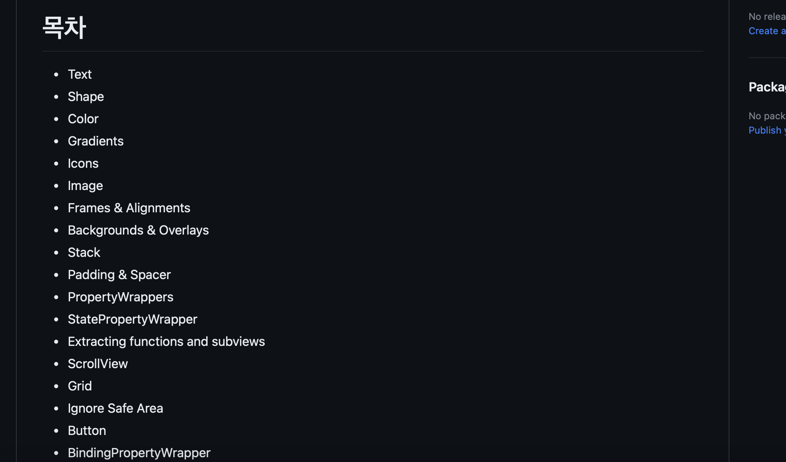
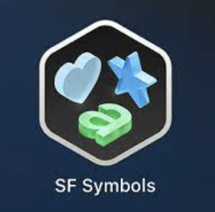
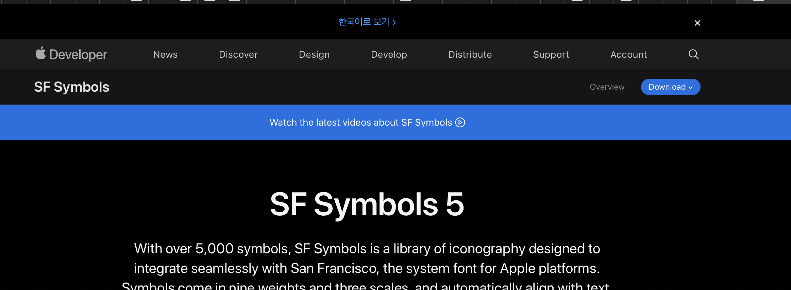
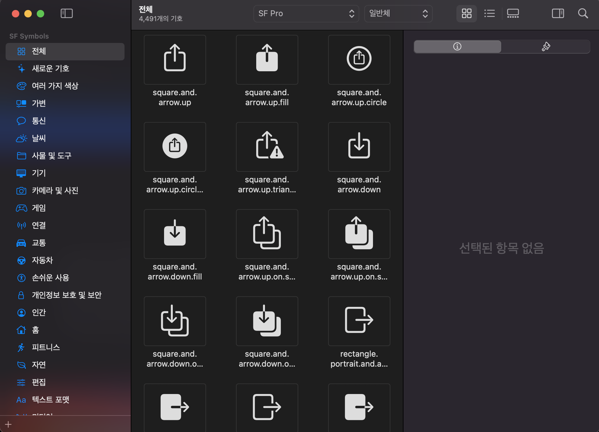
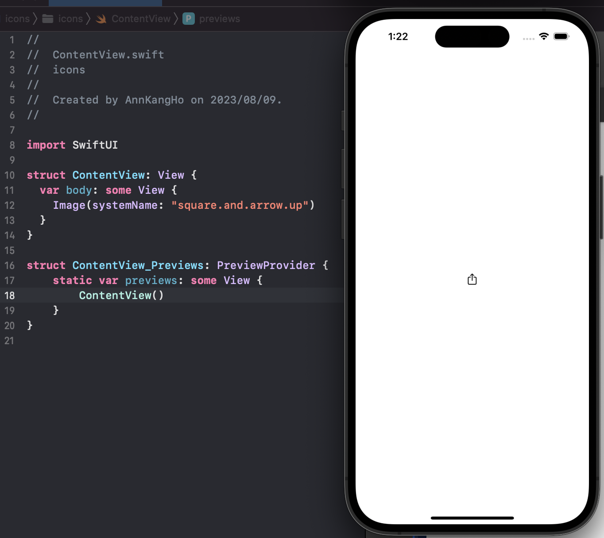
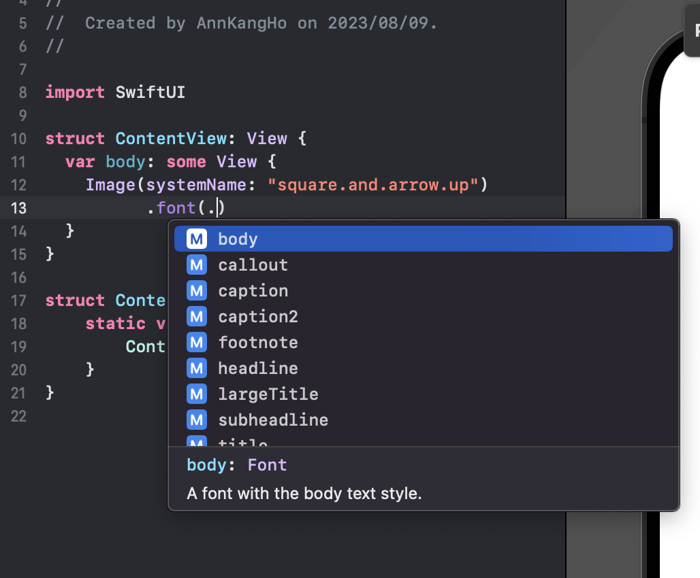
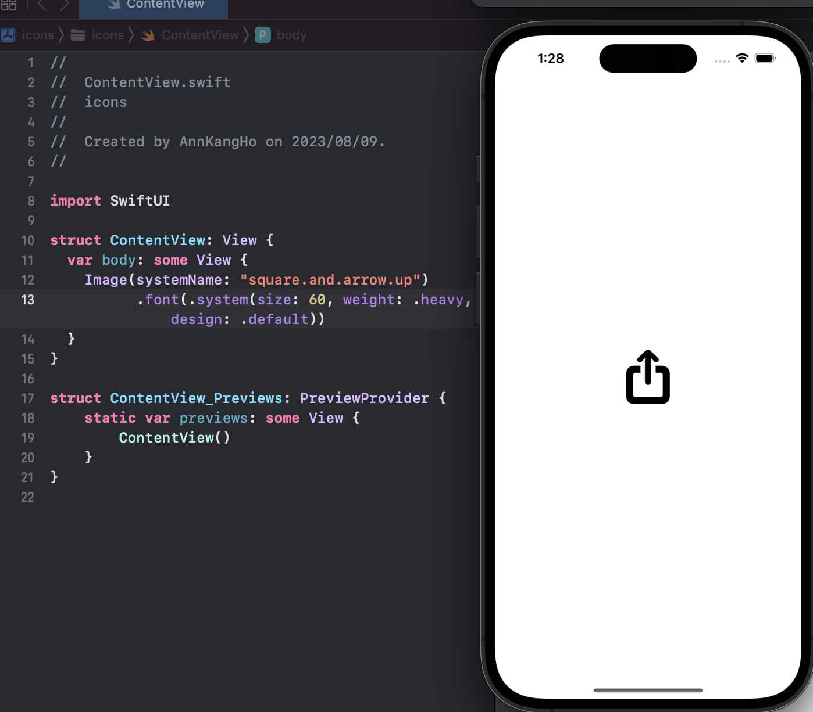
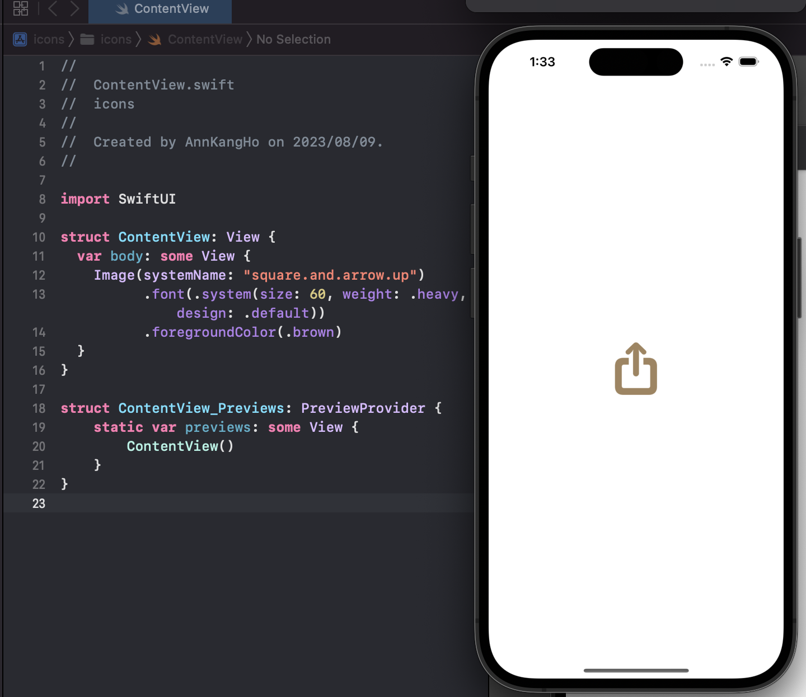
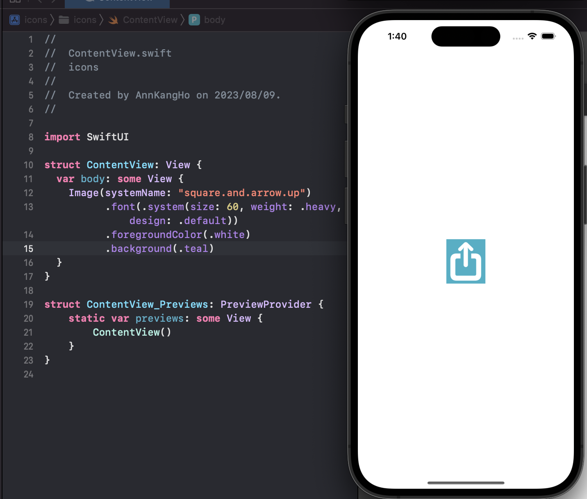

# iOS스터디 5 - icons
이번에 우리 학교에서 소규모로 진행되는 iOS 스터디에서 과제가 하나 나왔다.<br>
내가 이번에 맡은 구역은 **icons**라는 부분과 **images**부분을 맡게 되었는데..

목차에 보니까...



한 거의 80가까이 되는 양이...

### 배울게 산더미구나!
그럼 이제 잡소리는 집어치우고 먼저 다루게될 icons라는 부분을 다뤄보도록 하겠다!

## SwiftUI에서의 icons?
내가 인터넷에서 뒤적뒤적하다보니 icons = SF Symbols 인 것 같아서 SF Symbols의 개념을 먼저 잡고 들어가려고 한다!

### SF Symbols란?
SF Symbols는 Apple 플랫폼의 시스템 서체인 San Francisco와 매끄럽게 통합되도록 설계된 아이콘 라이브러리로, 5,000개 이상의 아이콘을 제공해준다!


___
### SF의 장점?
* **일관성과 통일성**<br>
    SF Symbols는 애플의 디자인 가이드라인을 따르고 있어서 앱 내에서는 일관된 디자인과 사용자 경험을 제공할 수 있다!

* **벡터 기반**<br>
    SF Symbol은 벡터 그래픽으로 제공되어 다양한 크기에서도 고품질의 아이콘을 보장한다!
* **동적 타입 지원**<br>
    사용자가 시스템 글꼴 크기를 변경할 때에도 SF Symbol은 자동으로 크기를 조정하여 가독성을 유지시킨다!
* **멀티 컬러 지원**<br>
    일부 아이콘은 멀티 컬러를 지원하여 다양한 컬러로 아이콘을 표현할 수 있다!
___
### SF의 단점?
* **개별적인 디자인 제한**<br>
    SF Symbol은 특정한 디자인 스타일과 가이드라인에 따르기 때문에, 완전히 고유한 아이콘을 디자인하고 싶을 때에는 제한이 있을 수 있다...

* **일부 아이콘의 복잡성**<br>
    일부 아이콘은 복잡한 디자인이나 세부 사항을 표현하기 어려울 수 있다...
* **맞춤형 아이콘 추가가 어려움**<br>
    SF Symbol 외의 맞춤형 아이콘을 추가하고 관리하려면 추가적인 작업이 필요할 수 있다.

### 이제 SF의 사용방법에 대해 한번 알아보자!
## SF Symbols 사용방법
> https://developer.apple.com/sf-symbols/

이 URL로 접속해서



오른쪽 위에 다운로드로 다운 받아주자!

다운을 다 받고 열어보면 



이런식으로 SF Symbols에 어떤 이미지들이 있는지 확인해볼 수 있다!

### 이 아이콘들을 Xcode에서 SwiftUI로 사용하려면 어떻게 해야될까?

위에 제시된 사진에서 왼쪽 위에 있는 **square.and.arrow.up** 을 사용해서 <br>다음과 같이 작성해보자!
```swift
struct ContentView: View {
  var body: some View {
    Image(systemName: "square.and.arrow.up")
  }
}
```
위의 코드를 실행하게 되면



위와 같이 잘 실행될 것이다!
___
### SF Symbols - font



SF에서는 위의 사진과 같이 font속성을 그대로 사용할 수 있다!
___
### SF Symbols - Size, Weight, Design
```swift
.font(.system(size: 60, weight: .heavy, design: .default))
```
이런식으로 작성해서 



size와 Weight 그리고 Design을 조절해서 사용 가능하다!

* size - 크기 조절
* weight - 기본 글시체 사용(bold, medium...등등)
* design - 말그대로 ㅎ
___
### SF Symbols - foregroundColor
```swift
.foregroundColor(원하는 색상)
```
이런식으로 foregroundColor를 사용해서



위와 같이 색상을 조정시킬 수 있다!
___
### SF Symbols - backgroundColor
```swift
.background(원하는 색상)
```
이런식으로 작성해서



위의 사진과 같이 배경색을 넣어서 조정시켜줄 수 있다!

더 자세히 배우고 싶다면

[Apple 공식 사이트](https://developer.apple.com/design/human-interface-guidelines/foundations/sf-symbols)

이 링크를 통해서 더 공부 하시길 바란다.
___
이상으로 SwiftUI에서의 icons에 대한 공부를 마치도록 하겠다!