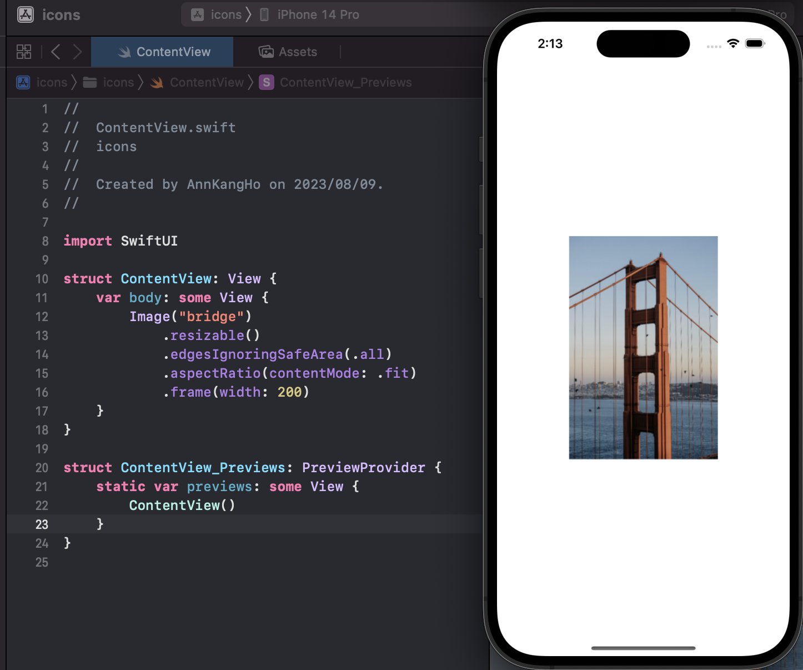
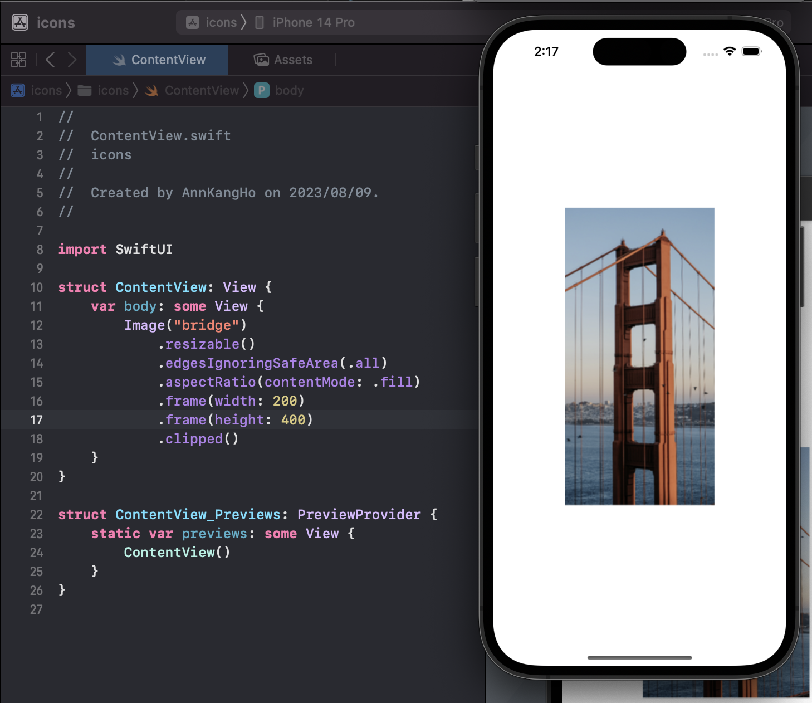

# iOS스터디 4 - images
다음으로 배울 것은 images에 대한 것이다!<br>
정리를 하다보니 벌써 2시가 다 되간다... <br>
### 얼른 끝내고 자러 가보자!

## SwiftUI에서의 images 사용방법
제일 먼저 해야될 것은 자신이 써야할 사진 넣기!

그러니 아래와 같이 assets 파일로 들어가서 원하는 사진을 넣어준다!


### 이러고 나서 과연 코드로는 어떻게 추가할까?

icons에서 썼던 것처럼
```swift
Image(systemName: 원하는 기본 이미지 이름)
```
이런식으로 Apple에서 제공해주는 기본 이미지를 사용해도 되고<br>
### 만일 외부에서 가져온 이미지라면?!!
```swift
Image("asset에 지정해놓은 이름")
```
이런식으로 사용해주면 된다!

## images - .resizable()

이미지를 추가하다보면 해상도가 화면을 초과하는 경우도 가끔 가다가 발생하는데 이를 해결하기 위해서
```swift
Image("asset에 지정해놓은 이름")
    .resizable()
```

이런식으로 resizable만 추가해주면 된다!!

## images - .edgesIgnoringSafeArea(.all)
만약, safeArea를 무시한 채 사진을 넣고 싶다면?

```swift
Image("asset에 지정해놓은 이름")
    .resizable()
    .edgesIgnoringSafeArea(.all)
```
이렇게 이미지 아래에 이런식으로 넣어주자!

## images - Aspect Fit / Aspect Fill
이미지를 추가하다보면 원하는 비율로 나오지 않는 경우도 있을 수 있다.

### 그럴때를 대비해서!
```swift
Image("asset에 지정해놓은 이름")
    .resizable()
    .scaledToFit()
```
이런식으로 .scaledToFit()을 추가해주면 비율을 유지해주면서 크기를 맞춰준다.

위의 다른 방식으로는 aspectRatio를 사용해서
```swift
Image("이미지이름")
	.resizable()
	.aspectRatio(contentMode: .fit)
```
이런식으로도 작성이 가능하다!

### 만일 여기서 이미지를 가능하면 아주 크게 확대하고 싶다면??

```swift
Image("이미지이름")
	.resizable()
	.aspectRatio(contentMode: .fill)
```

이런식으로 fit 대신에 fill을 넣어주자!<br>
(하지만, 이미지가 잘릴수도 있음..)
### .aspectRatio(contentMode: .fit)의 예시
```swift
struct ContentView: View {
    var body: some View {
        Image("bridge")
            .resizable()
            .edgesIgnoringSafeArea(.all)
            .aspectRatio(contentMode: .fit)
            .frame(width: 200)
    }
}
```


### .aspectRatio(contentMode: .fill)의 예시
```swift
struct ContentView: View {
    var body: some View {
        Image("bridge")
            .resizable()
            .edgesIgnoringSafeArea(.all)
            .aspectRatio(contentMode: .fill)
            .frame(width: 200)
    }
}
```

### 설정한 프레임을 초과했을 경우!
```swift
.clipped()
```
이걸 사용해서 원하는 사이즈로 자를 수 있도록 해준다.



## Creating a Image!!
SwiftUI에서 여러 모양들을 제공해주고 있는데,<br>
예시로 한번 Ellipse()를 사용해보자!
```swift
struct ContentView: View {
    var body: some View {
        Image("bridge")
            .resizable()
            .edgesIgnoringSafeArea(.all)
            .aspectRatio(contentMode: .fit)
            .frame(width: 200)
            .clipShape(Ellipse())
    }
}
```


#### 이외에도 동그라미, 캡슐.. 등이 있다!

## images - Opacity
SwiftUI에서도 UIKit과 마찬가지로 투명도를 조정할 수 있는데
값을 0과 1사이로 할당 시켜주면 된다!
```swift
struct ContentView: View {
    var body: some View {
        Image("bridge")
            .resizable()
            .edgesIgnoringSafeArea(.all)
            .aspectRatio(contentMode: .fit)
            .frame(width: 200)
            .clipShape(Ellipse())
            .opacity(0.5)
    }
}
```


## images - Overlay
이미지를 중복시키는 방식인 ContainerView 방식이 있는데 이를 사용하기 위해서 overlay를 사용해보자!
```swift
struct ContentView: View {
    var body: some View {
        Image("bridge")
            .resizable()
            .edgesIgnoringSafeArea(.all)
            .aspectRatio(contentMode: .fit)
            .frame(width: 200)
            .clipShape(Ellipse())
            .overlay(
                Image(systemName: "star.fill")
                    .font(.system(size: 150))
                    .foregroundColor(.blue)
                    .opacity(0.4)
            )
    }
}
```

#### 이렇게!! 두 이미지를 곂치는 것까지 한번 해보았다!!
___
휴 힘들었다... 

### 자세한건 애플 공식 사이트 참조 바람!!ㅎㅎ

이상으로 SwiftUI에서의 images 공부를 마치도록 하겠다.